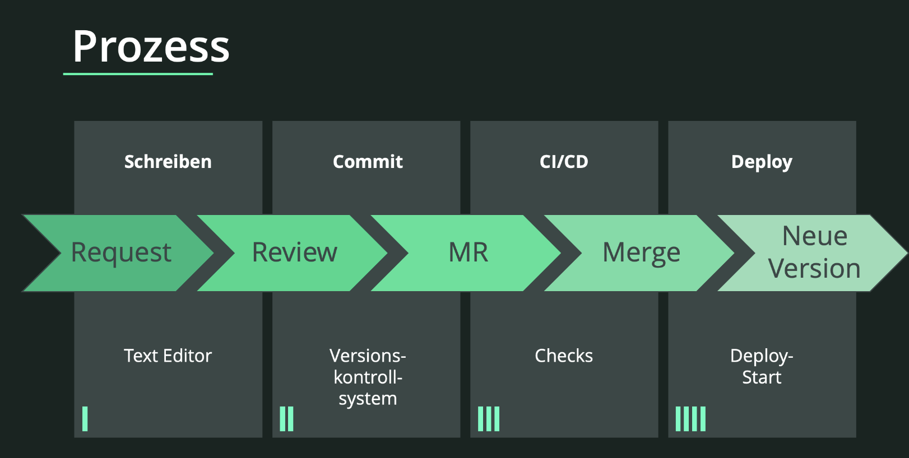

Main components
===============

* Text files (markup, markdown in contrast to binary formats such as in Adobe FrameMaker or Microsoft Word)
* Text editor like Atom or Sublime
* Static site generator, mostly open source such as Sphinx, Jekyll or Hugo 
* Storing in a version control system, mostly git
* Collaboration using git (branch, merge, push)
* CI/CD for automating the build of the target files
* Automated tests (link checker, formatting, terminology)

